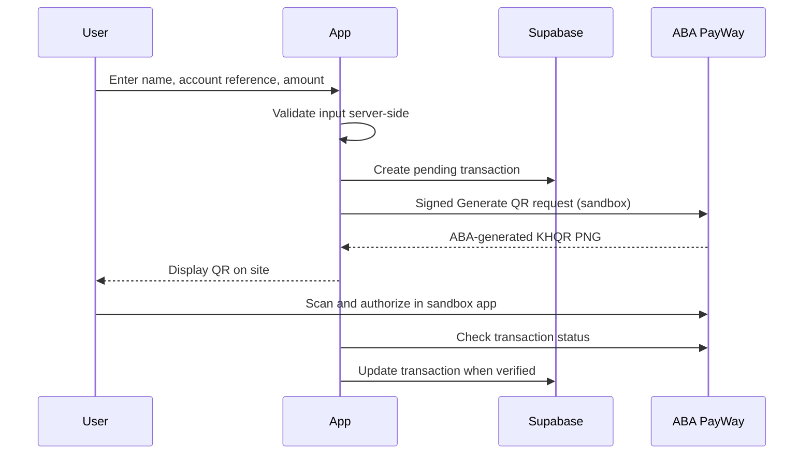

# Tovmuk Pay — ABA PayWay Integration

A deployed KHR payment integration built for the ABA PayWay Back-End Developer practical assessment.

The application collects:

- Sender name
- Account number
- Amount in KHR

It validates the payment server-side, creates a unique transaction, sends a signed request to ABA PayWay, stores the transaction, and verifies the final result through PayWay.

## Live Application

**URL:** https://seng.khmerfp.com (sandbox configuration)

`seng.khmerfp.com` is a CNAME to `pay.tovmuksolution.com`, which remains an alias for the same Vercel deployment. The `APP_BASE_URL` production setting uses the CNAME origin for PayWay sandbox requests.

## Tech Stack

- Next.js 16
- TypeScript
- Vercel
- Supabase PostgreSQL
- ABA PayWay API

No third-party PayWay SDK is used.

The PayWay integration logic is implemented directly from the official ABA PayWay documentation.

Main integration code:

`src/lib/payway.ts`

---

## Payment Flow

The deployed sandbox QR flow omits `callback_url` and polls ABA's Check transaction API. The hosted Purchase flow and callback handler remain in the code but are not used by the current QR deployment. The entered account number is a reconciliation reference; the QR collects for the configured ABA merchant.

## Local setup

Install Node 24 and pnpm, then run `pnpm install`. Copy `.env.example` to an ignored `.env.local`, fill in the sandbox merchant ID, API key, and Supabase credentials, and run `pnpm dev`. The database schema is in `supabase/migrations/`. Do not commit real `.env` files. Run `pnpm test` and `pnpm build` to verify the project.

## Evidence and current limits

See [docs/EVIDENCE.md](docs/EVIDENCE.md) and the separate submission evidence package for screenshots, transaction IDs, API responses, and redacted database records. On 28 September 2026, both the original domain and the new CNAME were tested: 1 KHR Generate QR requests failed with HTTP 400/code `04` (“The given data was invalid”); 2,000 KHR requests returned ABA QRs and `PENDING` transactions. No approved payer-app payment was observed. ABA's written domain-whitelist confirmation has not been received.

## Required environment variables

`PAYWAY_MERCHANT_ID`, `PAYWAY_API_KEY`, `PAYWAY_BASE_URL`, `PAYWAY_SANDBOX_QR`, `APP_BASE_URL`, `SUPABASE_URL`, `SUPABASE_SECRET_KEY`. The real values belong in local ignored environment files or the deployment's secret/configuration store. `.env.example` contains names only.

## Account number and purchase flow

PayWay's Purchase API has no destination-account field. The submitted number is stored in our database under `tran_id` and sent as `account_number` in signed, Base64-encoded `custom_fields` for reconciliation. It does not direct the QR payment to that account; PayWay collects for the configured merchant.

The hosted Purchase path signs request fields on the server. Return and cancel routes use a fresh PayWay status check; neither treats a browser redirect as payment success. The callback handler verifies `X-PAYWAY-HMAC-SHA512`, confirms the amount and currency, checks PayWay independently, and applies idempotent database transitions. The current deployed sandbox QR mode omits `callback_url`, so no callback payload is available for the two submitted tests.

## Scope and AI assistance

The original exam note requested live Purchase transactions with hosted checkout, redirects, and callback evidence. A later instruction from Hoa requested sandbox tests without a callback and submission as-is. This deployment follows that later instruction; live payment completion and a callback were not demonstrated. Claude Code and Codex assisted with code, documentation, and test verification. The candidate should review and be able to explain the signing and callback logic.
