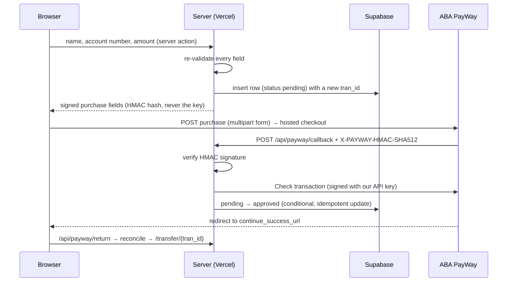

# Tovmuk Pay: ABA PayWay integration

A KHR transfer form that takes a payer from **name, account number and amount** to a
**verified result** through ABA PayWay's hosted checkout.

- **Live:** https://pay.tovmuksolution.com. This is my own domain, not `khmerfp.com`, and it stays live through Monday 28 September.
- **Stack:** Next.js 16 (App Router, TypeScript) on Vercel (Singapore, `sin1`), with Supabase Postgres. There is no PayWay SDK; the protocol code is in [`src/lib/payway.ts`](src/lib/payway.ts).
- **Source of truth:** the official docs at developer.payway.com.kh: Purchase, Check transaction and Ecommerce Checkout ("Verify Callback Signature").

## Flow



The PayWay URLs we sign into every purchase:

| PayWay field | Our URL | Role |
| --- | --- | --- |
| `return_url` (Base64) | `https://pay.tovmuksolution.com/api/payway/callback` | **Server-to-server callback**, the authoritative result |
| `continue_success_url` | `https://pay.tovmuksolution.com/api/payway/return?tran_id=…` | Browser redirect after paying (the exam's "Return URL") |
| `cancel_url` | `https://pay.tovmuksolution.com/api/payway/cancel?tran_id=…` | Browser redirect after cancelling or closing checkout |

Watch the naming: PayWay's `return_url` is the callback, not the browser return.

## Setup

Requirements: Node 24, pnpm, a Supabase project, a Vercel project and PayWay credentials.

```bash
pnpm install
cp .env.example .env.local           # fill in values (see below)
supabase link --project-ref <ref>    # then apply the schema:
supabase db push                     # supabase/migrations/*.sql
pnpm test                            # unit tests
```

**Local end-to-end run (no real money).** [`test/mock-payway.ts`](test/mock-payway.ts) implements the parts of PayWay this app uses:
- the purchase POST, with hash checked and the documented error codes 1, 4 and 47
- a hosted checkout with Pay, Decline and Cancel
- the HMAC-signed callback
- Check transaction

Set `PAYWAY_BASE_URL=http://localhost:4010` in `.env.local`, then:

```bash
pnpm mock                            # mock PayWay on :4010
pnpm build && pnpm start             # app on :3000 (APP_BASE_URL must match)
```

**Deploy:**

```bash
vercel env add PAYWAY_MERCHANT_ID production
vercel env add PAYWAY_API_KEY production --sensitive
vercel deploy --prod
```

## Environment variables

| Name | Secret | Purpose |
| --- | --- | --- |
| `PAYWAY_MERCHANT_ID` | no | Merchant ID issued by ABA |
| `PAYWAY_API_KEY` | **yes** | HMAC-SHA512 key for request hashes and callback signatures |
| `PAYWAY_BASE_URL` | no | Optional. Defaults to `https://checkout.payway.com.kh` (production) |
| `APP_BASE_URL` | no | Public origin used to build the signed callback, return and cancel URLs |
| `SUPABASE_URL` | no | Supabase project URL |
| `SUPABASE_SECRET_KEY` | **yes** | Server-only Supabase key (`sb_secret_…`). The browser never talks to the database |

Secrets live only in Vercel's encrypted environment and a git-ignored `.env.local`. The modules that read them import `server-only`, so any import from browser code fails the build.

## Where the account number goes, and why

PayWay's purchase request has no account-number field. The value lives in two places:

1. **Our database, keyed by `tran_id` (the source of truth).** The row, including `account_number`, is written **before** any signed request leaves the server. Every later event (callback, redirect, status check) finds the transfer by `tran_id`, the one identifier PayWay always echoes back.
2. **`custom_fields` in the purchase request**, as Base64 JSON: `{"account_number": "…", "sender_name": "…"}`. PayWay shows custom fields in its transaction list, details and export. The merchant can therefore reconcile a payment against its destination account from PayWay's side alone, without our database. `custom_fields` is part of the purchase hash, so the browser cannot change it without PayWay rejecting the request.

The other options, and why I didn't use them:
- **`items`** is display-only. It is shown to the payer as a line item and is not meant to carry an identifier.
- **`return_params`** comes back to us in the callback. Trusting data that round-trips through PayWay adds nothing when `tran_id` already joins the records.
- **`payout`** actually moves money to whitelisted beneficiary accounts. That is a different product, and the exam defines this field as an identifier.

## How callbacks are verified

The callback is the authoritative result, but only after authentication.
[`processCallback`](src/lib/settlement.ts) runs these steps:

1. **Parse defensively.** The body is JSON per the docs; form-encoded is also accepted. A malformed body gets `400`, one over 64 KB gets `413`, a badly formed `tran_id` gets `400`, and an unknown `tran_id` gets `404`.
2. **Check the HMAC signature.** PayWay sends `X-PAYWAY-HMAC-SHA512`. We sort the body's keys, concatenate the values using PHP's string rules (nested arrays are `json_encode`d), compute `base64(HMAC-SHA512(…, API key))`, and compare in constant time.
   - The implementation is checked against PayWay's own PHP sample code: [`test/payway-reference.php`](test/payway-reference.php) produces the expected values used in [`payway.test.ts`](src/lib/payway.test.ts).
   - A **wrong signature gets `401`**, and the body is ignored completely.
3. **Confirm with PayWay independently.** We call **Check transaction**, signed with our own key and sent over TLS to PayWay, and PayWay's answer is final:
   - `APPROVED` settles the payment, but only if PayWay's amount equals the amount we signed. Otherwise the transfer goes to `review`.
   - `DECLINED`, `CANCELLED` and `REFUNDED` map straight through.
   - `PENDING` and `PRE-AUTH` are never treated as paid.
4. **Fallback.** If the status API is unreachable, a *signed* callback may settle the payment on its own, since the HMAC authenticates it, again only with a matching amount and currency. An **unsigned** callback that can't be confirmed gets `503`, so PayWay retries.
5. **Idempotency.** Status changes are single `UPDATE … WHERE status IN (allowed states)` statements (see [`status.ts`](src/lib/status.ts)). A repeated or concurrent callback matches no row and records nothing. The first signed callback is stored verbatim as evidence.

The browser redirects (`/api/payway/return` and `/api/payway/cancel`) **never settle a payment**; they only trigger the same check. A cancel is recorded only while PayWay still reports the payment as unpaid, and a later verified payment overrides it.

## Transaction states

| Status | Meaning |
| --- | --- |
| `pending` | Recorded and signed. Waiting for PayWay |
| `approved` | PayWay confirmed the payment, and the amount matches what we signed |
| `declined` | PayWay declined the payment |
| `cancelled` | The payer cancelled, or the 15-minute checkout lifetime expired |
| `failed` | PayWay has no record of the checkout 2 minutes after we created it (the request was rejected, e.g. code 47) |
| `review` | PayWay's answer contradicts our record (amount or status). Not treated as paid |
| `refunded` | PayWay reports a refund |

Each record stores the transaction ID, name, account number, amount, currency, status, PayWay status and code, approval code, payment method, bank reference, how it was verified, the raw callback, and timestamps. See [`supabase/migrations`](supabase/migrations).

## Security

- **Signing is server-side only.** The browser receives signed form fields; the API key never leaves the server process.
- **Amounts are re-validated on the server:** whole riel from 1 to 100,000, digits only, no decimals or separators. Database `CHECK` constraints repeat every rule, and the hash makes a changed amount useless.
- **Input is strictly validated:**
  - Names allow letters in any script (Latin, Khmer), spaces, `' . -`, 2–100 characters.
  - Account numbers must be 6–20 digits.
  - Database access is parameterised through PostgREST, and React escapes everything it renders.
- **Database access is locked down.** Row-level security is enabled with no policies, and the table's privileges are revoked from the public API roles.
- **The site is HTTPS-only** with HSTS, `nosniff`, `frame-ancestors 'none'`, and `strict-origin-when-cross-origin`. That referrer policy keeps our origin on the POST to PayWay, which checks its domain whitelist.
- **Logs are structured JSON**, one line per event, for every outbound request and inbound callback. Keys like `hash`, `signature` and `api_key` are redacted, and account numbers are masked.
- **`tran_id` is hard to guess:** `TP` + UTC timestamp + 6 CSPRNG base-36 characters, 20 characters in total, PayWay's maximum.

## Error handling

| Situation | Behaviour |
| --- | --- |
| PayWay API timeout (8 s) or network error | Logged. The transfer stays `pending` and is re-checked on the next callback, page view or poll |
| Database down before signing | Nothing is sent to PayWay. The payer sees "We couldn't record this transfer" |
| PayWay rejects the purchase (e.g. code 47) | The checkout is never created. The transfer becomes `failed` after a 2-minute grace period |
| Declined, cancelled or expired | Plain-language status page. "No money was taken" |
| Duplicate, forged or malformed callback | No-op `200`, `401`, and `400` respectively. Every case is logged with context |
| Callback that can't be verified yet | `503`, so PayWay retries |

## Tests

```bash
pnpm test        # 28 unit tests, node:test, no framework
pnpm typecheck
pnpm lint
```

The tests cover:
- the purchase and check-transaction hashes, against PayWay's PHP reference
- the callback signature, including PHP type juggling for nested, boolean and null values
- tamper detection
- check-response parsing (including the "code 6 means not found or wrong domain" ambiguity)
- the state machine: amount mismatch, contradictions, lifetime expiry, one-way transitions
- validation (injection strings, decimals, separators) and log redaction

The full flow was also run end to end against `test/mock-payway.ts`: pay, decline, cancel, a code-47 rejection, duplicate and forged callbacks, and oversized and malformed bodies.

## Evidence

`pnpm evidence <tran_id>` prints a transaction's stored record and the raw callback payload PayWay sent. See [`docs/EVIDENCE.md`](docs/EVIDENCE.md) for the capture checklist for the 1 KHR and 2,000 KHR transactions.

## Known gaps, and what I'd do with two more days

- **1 KHR vs PayWay's minimum.** The Purchase docs list error 47, "KHR amount must be greater than 100 KHR". The form accepts 1 KHR as the exam requires. If the live profile enforces the minimum, PayWay rejects the checkout and the attempt is recorded as `failed` rather than hidden.
- **Server-to-server whitelisting.** Vercel functions have no fixed egress IP. If PayWay whitelists Check transaction by IP rather than domain, signed callbacks still settle payments, but I would add a static-IP egress.
- **Rate limiting and bot protection** on the form (Vercel Firewall or BotID).
- **A scheduled reconciliation sweep** for abandoned `pending` transfers. Today they resolve when viewed or when PayWay calls back.
- **Close transaction on cancel**, so a cancelled checkout can never be paid later.

## AI assistance

This project was built with Claude Code (Anthropic's coding agent). It was used to:
- write the code, tests and documentation
- cross-check the signing logic against PayWay's PHP reference code
- run the end-to-end tests against the local PayWay mock

The design decisions above are explained so they can be reviewed and defended without the tool.
